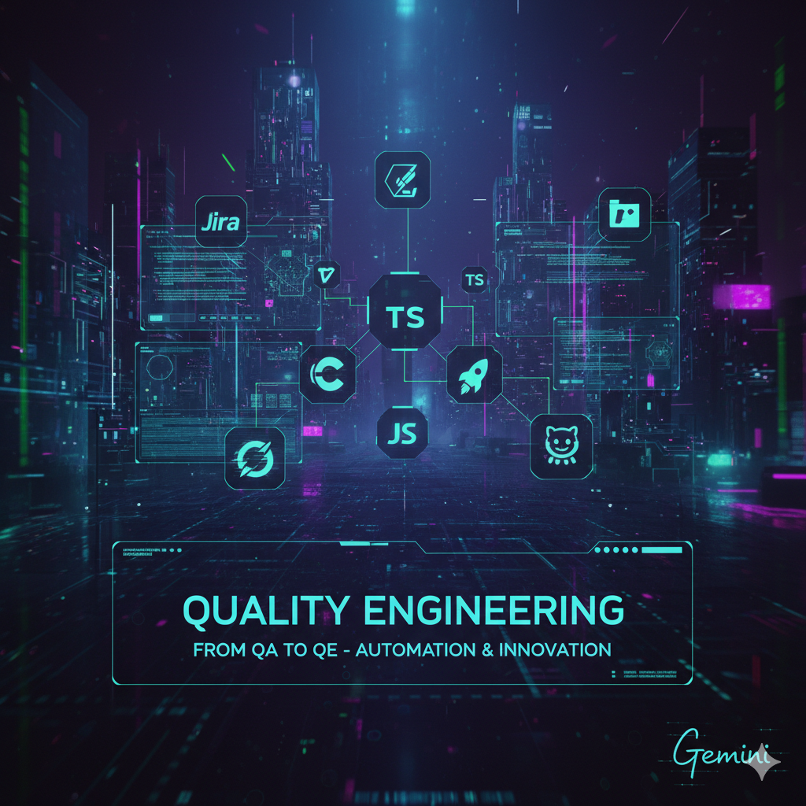

<h1 align="center">Hi, I'm Alyson Oliveira 👋</h1>

<h3 align="center">
Quality Assurance ➜ Quality Engineer  
Automation • Quality Mindset • Real-World Testing
</h3>

---

## 👨‍💻 About Me

I am a **Quality Assurance professional transitioning into a Quality Engineer role**, with a strong focus on **test automation, quality strategy, and real-world testing practices**.

My background started in manual testing and exploratory analysis, but my current goal is to **design, automate, and maintain reliable test solutions** that truly support engineering teams — not just “check boxes”.

I believe quality is not a phase.  
It’s a **continuous engineering responsibility**.

---

## 🚀 Current Focus

- Building **automation-first test suites** using Cypress
- Designing test cases based on **real product behavior**, not only happy paths
- Structuring tests to be **readable, scalable, and maintainable**
- Turning QA exercises into **portfolio-ready case studies**
- Strengthening my transition from **QA ➜ QE mindset**

---

## 🧪 Featured Case Study

### 🔹 Cypress Real World App — Login & Sign Up

This repository is being used as a **QA Automation Portfolio Case**, where I apply:

- Test case design based on functional requirements
- Positive and negative scenarios
- UI validations (disabled buttons, error messages, navigation)
- Edge cases and UX inconsistencies
- Clean assertions focused on **behavior**, not implementation details
- Clear documentation aimed at recruiters and engineers

👉 **Access the case here:**  
🔗 https://github.com/alysonoliveira-qa/cypress-realworld-app

---

## 🛠️ Tech Stack & Tools

- **Automation:** Cypress, JavaScript, TypeScript  
- **Testing Concepts:** E2E Testing, Functional Testing, Exploratory Testing  
- **Version Control:** Git & GitHub  
- **CI & Quality:** GitHub Actions, Linting, Formatting  
- **Organization:** Test Case Design, Mind Maps, Documentation

---

## 🧠 Quality Philosophy

- Tests should explain **why** something failed, not just **that** it failed  
- Automation should **support product decisions**, not slow teams down  
- A good QE understands **product, user, and engineering constraints**

---

## 📬 Let’s Connect

- 💼 LinkedIn: *(link in pinned post)*  
- 🧪 GitHub: You are here 😉  

I’m always open to discussions about **quality, automation, and engineering culture**.

