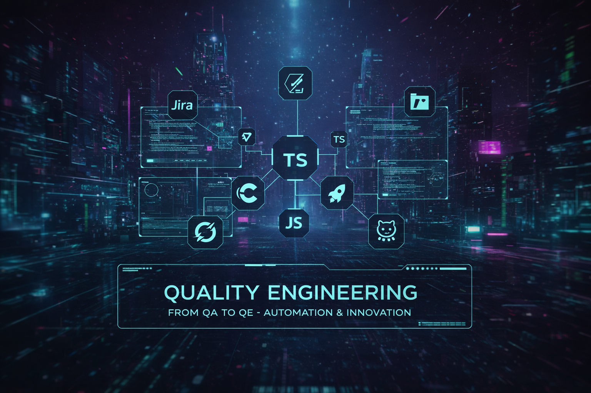

🇧🇷 [Versão em Português](README-PT.md)

## 👋 Hi, I'm Alyson Oliveira

I'm a **Quality Assurance professional in clear transition to Quality Engineering**, focused on automation, testing strategy, and engineering mindset.

My journey started with manual and functional testing, but over time I naturally evolved toward **test automation, system behavior validation, and maintainable test design** — treating tests as engineering assets rather than simple scripts.

---

## 🚀 What I'm currently working on

- Test automation using **Cypress & TypeScript**
- Designing **realistic test scenarios** based on real user behavior
- Validating applications through **business rules and UX behavior**
- Turning technical exercises into **portfolio-ready case studies**
- Documenting decisions, trade-offs, and known issues clearly

---

## 🧠 QA → QE Mindset

- Quality as a **shared engineering responsibility**
- Tests focused on **behavior, not implementation**
- Assertions based on **what really protects the product**
- Documentation as part of the quality process
- Continuous learning through hands-on practice

---

## 🛠 Tools & Technologies

- Cypress  
- TypeScript / JavaScript  
- Git & GitHub (commits, PRs, documentation)  
- CI-friendly test design  
- Agile & real-world QA workflows  

---

## 📂 Featured Work

### 🔹 QA Automation Case — Cypress Real World App
A practical automation case covering **Login and Sign Up flows**, where I document:
- Test strategy
- Test cases and coverage
- Known issues found during testing
- Decisions made to improve test reliability

👉 **Repository:**  
https://github.com/alysonoliveira-qa/cypress-realworld-app

---

## 🌍 Languages

- 🇺🇸 English (B2 – strong reading & listening, working communication in professional environment)  
- 🇧🇷 Portuguese (native)

---

## 🔗 Connect with me

- 💼 LinkedIn: https://www.linkedin.com/in/alyson-oliveira  
- 💻 GitHub: https://github.com/alysonoliveira-qa  

---

📌 *This profile reflects my continuous evolution from QA to Quality Engineering through real-world practice, automation, and clear communication.*

- 💼 LinkedIn: https://www.linkedin.com/posts/alyson-r-de-oliveira-33a1a485_post-fixo-de-qa-para-quality-engineer-activity-7424273717876330496-akep
- 🧪 GitHub: You are here 😉  

I’m always open to discussions about **quality, automation, and engineering culture**.

